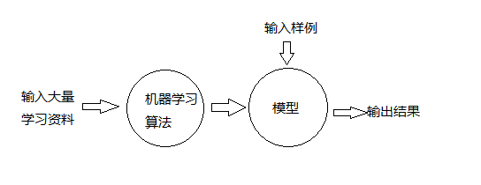

---

---

# 机器学习

- 识别垃圾邮件
- 图像识别
- 人脸识别
- 数字识别
  - MINST数据集

## 基础

### 数据

- 数据整体叫数据集(dataset)
- 每一行数据成为一个样本(sample)
- 除最后一列,每一列表达样本的一个特征(feature)

- 最后一列,称为标记(label)
- 特征空间(feature space)
  - 分类任务的本质就是在特征空间切分
  - 在高维空间同理
  - 图像,每一个像素点都是特征

### 基本任务

#### 分类任务

- 二分类
- 多分类
- 多标签分类

#### 回归任务

- 结果是一个连续数字的值,而非一个类别
  - 房屋价格
  - 市场分析
  - 学生成绩
  - 股票价格
- 有些算法只能解决分类问题,有些只能解决回归问题,有些算法都能解决
- 一些情况下,回归任务可以简化成分类任务

### 机器学习算法分类

- 监督学习
- 非监督学习
- 半监督学习
- 增强学习

#### 监督学习

- 给机器的训练数据拥有标记或者答案
- 解决分类问题和回归问题
- k近邻
- 线性回归和多项式回归
- 逻辑回归
- SVM
- 决策树和随机森林

#### 非监督学习

- 给机器训练的数据没有标记或者答案
- 对没有标记的数据进行分类-聚类分析
- 对数据进行降维处理
  - 特征提取:信用卡的信用评级和人的胖瘦无关?
  - 特征压缩:PCA
- 方便可视化
- 异常检测

#### 半监督学习

- 一部分数据有标记或者答案,另一部分没有
- 更常见:各种原因产生的标记缺失
- 通常都先使用无监督学习手段对数据做处理,之后使用监督学习手段做模型的训练和预测

#### 增强学习

- 根据周围的环境,采取行动,根据采取行动的结果,学习行为方式
- 无人驾驶
- 机器人

### 机器学习的其他分类

#### 批量学习(Batch Learning)

- 优点:简单
- 问题:如何适应环境的变化?
- 解决方案:定时重新批量学习
- 缺点:
  - 每次重新批量计算,运算量巨大；
  - 在某些环境变化非常快的的情况下,甚至不可能。

#### 在线学习(Online Learning)

- 优点：及时反映新的环境变化
- 问题：新的数据带来不好的变化？
- 解决方案：加强对数据的监控
- 其他：也适用于数据量巨大，完全无法批量学习的环境

#### 参数学习

- 一旦学习到了参数，就不再需要原有的数据集

#### 非参数学习

- 不对模型进行过多假设
- 非参数不等于没参数

## KNN

- k近邻算法：给定点根据距离最近的k个点的结果投票，得出给定点的分类
- KNN算法是唯一一个不需要训练过程的算法，是没有模型的算法
- 对于KNN来说，训练集就是模型
- 缺点：
  1. 效率低下
  2. 高度数据相关
  3. 预测结果不具有可解释性
  4. 维数灾难：随着维度的增加，看似相近的两个点之间的距离越来越大

### 超参数和模型参数

- 超参数：在算法运行前需要决定的参数
  - 寻找好的超参数：
    - 领域数值
    - 经验数值
    - 实验搜索
- 模型参数：算法过程中学习的参数

- kNN算法没有模型参数
- kNN算法中的k是典型的超参数
- kNN算法中是否考虑距离也是超参数
- kNN算法中**明科夫斯基距离**的p也是超参数

### 数据归一化

- 最值归一化（normalization）

  - 把所有数据映射到0-1之间

  $$
  x_{scale}=\frac{x-x_{min}}{x_{max}-x_{min}}
  $$

  - 适用于分布有明显边界的情况：受outlier影响较大

- 均值方差归一化（standardization）

  - 把所有数据归一到均值为0方差为1的分布中

  $$
  x_{scale}=\frac{x-x_{mean}}{s}
  $$

- 对测试数据集如何归一化？

  - 真实环境很有可能无法得到所有测试数据的均值和方差
  - 对数据的归一化也是算法的一部分
  - (x_test-mean_train)/std_train

## 线性回归

## 梯度下降法

- 不是一个机器学习算法
- 是一种基于搜索的最优化方法
- 作用：最小化一个损失函数
- 梯度上升法：最大化一个效用函数
- 并不是所有函数都有唯一的极值点
  - 解决方案：多次运行，随机初始化点

## 多项式回归

## 逻辑回归

## 模型正则化

## PCA

## SVM

## 决策树

## 随机森林

## 集成学习

## 模型选择

## 模型调整

